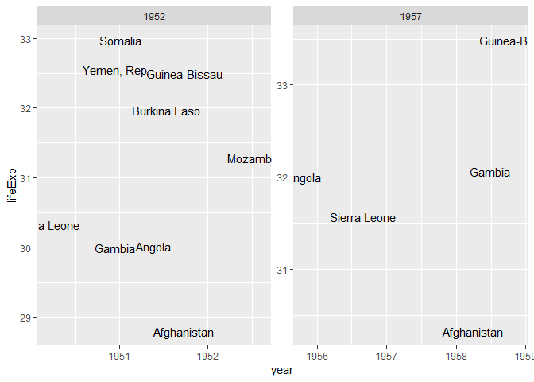
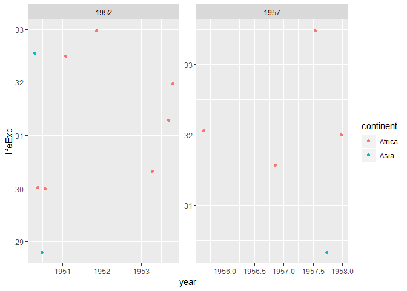

gapminder-hw003
================
Nicole Mak
01/10/2018

**First, let’s load the data and the packages we will use.**

``` r
library(gapminder)
library(tidyverse)
```

    ## -- Attaching packages ------------------------------------ tidyverse 1.2.1 --

    ## v ggplot2 3.0.0     v purrr   0.2.5
    ## v tibble  1.4.2     v dplyr   0.7.6
    ## v tidyr   0.8.1     v stringr 1.3.1
    ## v readr   1.1.1     v forcats 0.3.0

    ## -- Conflicts --------------------------------------- tidyverse_conflicts() --
    ## x dplyr::filter() masks stats::filter()
    ## x dplyr::lag()    masks stats::lag()

``` r
library(dplyr)
library(ggplot2)
```

# Homework \#3 assignment **Task Menu**:

Get the maximum and minimum of GDP per capita for all continents. Look
at the spread of GDP per capita within the continents.

Compute a trimmed mean of life expectancy for different years. Or a
weighted mean, weighting by population. Just try something other than
the plain vanilla mean.

How is life expectancy changing over time on different continents?

Report the absolute and/or relative abundance of countries with low life
expectancy over time by continent: Compute some measure of worldwide
life expectancy – you decide – a mean or median or some other quantile
or perhaps your current age. Then determine how many countries on each
continent have a life expectancy less than this benchmark, for each
year.

Find countries with interesting stories. Open-ended and, therefore,
hard. Promising but unsuccessful attempts are encouraged. This will
generate interesting questions to follow up on in class.

## First exercise:

*Get the maximum and minimum of GDP per capita for all continents. Look
at the spread of GDP per capita within the continents.*

``` r
gapminder %>% 
 group_by(continent) %>% 
 summarize(min(gdpPercap), max(gdpPercap))
```

    ## # A tibble: 5 x 3
    ##   continent `min(gdpPercap)` `max(gdpPercap)`
    ##   <fct>                <dbl>            <dbl>
    ## 1 Africa                241.           21951.
    ## 2 Americas             1202.           42952.
    ## 3 Asia                  331           113523.
    ## 4 Europe                974.           49357.
    ## 5 Oceania             10040.           34435.

``` r
#structuring data by continent
#then requesting that desired observation (minimum and maximum) be summarized in a table, by continent
```

What we observe is that some continents have a larger disparity than
others do\! The range for the continents of Africa and Asia is
staggering….

Let’s make a graphs to illustrate this\!

``` r
gapminder %>% 
 group_by(continent) %>%
 ggplot(aes(continent, log(gdpPercap))) +
 geom_point(alpha = 0.05)
```

<!-- -->

``` r
gapminder %>% 
 group_by(continent) %>%
 ggplot(aes(continent, log(gdpPercap))) +
 geom_boxplot()
```

<!-- -->

\#\#Second exercise

*Compute a trimmed mean of life expectancy for different years. Or a
weighted mean, weighting by population. Just try something other than
the plain vanilla mean.*

``` r
gapminder %>% 
 group_by(continent, year) %>% 
 summarise(mean_lifeExp_weighted = weighted.mean(lifeExp, pop))
```

    ## # A tibble: 60 x 3
    ## # Groups:   continent [?]
    ##    continent  year mean_lifeExp_weighted
    ##    <fct>     <int>                 <dbl>
    ##  1 Africa     1952                  38.8
    ##  2 Africa     1957                  40.9
    ##  3 Africa     1962                  43.1
    ##  4 Africa     1967                  45.2
    ##  5 Africa     1972                  47.2
    ##  6 Africa     1977                  49.2
    ##  7 Africa     1982                  51.0
    ##  8 Africa     1987                  52.8
    ##  9 Africa     1992                  53.4
    ## 10 Africa     1997                  53.3
    ## # ... with 50 more rows

``` r
#This is a calculation of the weighted mean life expectancy by population for each continent. The means are separated by year so we can observe trends of change in lifeExp over time.
```

``` r
gapminder %>% 
 group_by(continent, year) %>%
 summarise(mean_lifeExp_weighted = weighted.mean(lifeExp, pop)) %>% 
 ggplot(aes(year, mean_lifeExp_weighted))+
  geom_point(aes(colour = continent))
```

<!-- -->

``` r
#graphical representation of second exercise
```

\#\#Third exercise We can use the above information to make some figures
which illustrate how life expectancy changes over time. How is life
expectancy changing over time on different continents?

``` r
gapminder %>%
  group_by(continent, year) %>% 
  summarise(mean_lifeExp_weighted = weighted.mean(lifeExp, pop)) %>% 
  ggplot(aes(year, mean_lifeExp_weighted))+
  geom_line(aes(colour = continent))
```

<!-- -->

``` r
#we can even make it a line plot. More still, we can put a regression line to trend overall trend in weighted lifeExp across all continents.

gapminder %>%
  group_by(continent, year) %>% 
  summarise(mean_lifeExp_weighted = weighted.mean(lifeExp, pop)) %>% 
  ggplot(aes(year, mean_lifeExp_weighted))+
  geom_point(aes(colour = continent))+
  geom_smooth()
```

    ## `geom_smooth()` using method = 'loess' and formula 'y ~ x'

<!-- -->

\#\#Fourth exercise

*Report the absolute and/or relative abundance of countries with low
life expectancy over time by continent: Compute some measure of
worldwide life expectancy – you decide – a mean or median or some other
quantile or perhaps your current age. Then determine how many countries
on each continent have a life expectancy less than this benchmark, for
each year.*

``` r
#Step 1: compute the median life Exp worldwide per year measured.
gapminder %>%
 group_by(year) %>% 
 summarise(median = median(lifeExp))
```

    ## # A tibble: 12 x 2
    ##     year median
    ##    <int>  <dbl>
    ##  1  1952   45.1
    ##  2  1957   48.4
    ##  3  1962   50.9
    ##  4  1967   53.8
    ##  5  1972   56.5
    ##  6  1977   59.7
    ##  7  1982   62.4
    ##  8  1987   65.8
    ##  9  1992   67.7
    ## 10  1997   69.4
    ## 11  2002   70.8
    ## 12  2007   71.9

``` r
#Step 2: Determine which countries have a life expectancy below the median.
gapminder %>%
 group_by(year) %>% 
 mutate(median = median(lifeExp)) %>% 
 filter(lifeExp<median)
```

    ## # A tibble: 852 x 7
    ## # Groups:   year [12]
    ##    country     continent  year lifeExp      pop gdpPercap median
    ##    <fct>       <fct>     <int>   <dbl>    <int>     <dbl>  <dbl>
    ##  1 Afghanistan Asia       1952    28.8  8425333      779.   45.1
    ##  2 Afghanistan Asia       1957    30.3  9240934      821.   48.4
    ##  3 Afghanistan Asia       1962    32.0 10267083      853.   50.9
    ##  4 Afghanistan Asia       1967    34.0 11537966      836.   53.8
    ##  5 Afghanistan Asia       1972    36.1 13079460      740.   56.5
    ##  6 Afghanistan Asia       1977    38.4 14880372      786.   59.7
    ##  7 Afghanistan Asia       1982    39.9 12881816      978.   62.4
    ##  8 Afghanistan Asia       1987    40.8 13867957      852.   65.8
    ##  9 Afghanistan Asia       1992    41.7 16317921      649.   67.7
    ## 10 Afghanistan Asia       1997    41.8 22227415      635.   69.4
    ## # ... with 842 more rows

``` r
#Step 3: Visually approximate the number of countries with life expectancy below the median. Use aesthetics to set parameters which demonstrate countries not meeting or exceeding the benchmark.
 
gapminder %>%
 group_by(year) %>% 
 mutate(median = median(lifeExp)) %>%
 ggplot(aes(year, lifeExp)) +
 geom_jitter(aes(colour = (lifeExp < median)), alpha = 0.5)
```

<!-- -->

``` r
#We can also use the `if_else` function to help us identify which countries are less than the benchmark median for each year. Let's identify those countries with low life expectancy with the word "lower".

gapminder %>%
 group_by(year) %>% 
 mutate(median = median(lifeExp)) %>%
 mutate (benchmark = if_else(lifeExp<median, "lower", "higher"))
```

    ## # A tibble: 1,704 x 8
    ## # Groups:   year [12]
    ##    country     continent  year lifeExp      pop gdpPercap median benchmark
    ##    <fct>       <fct>     <int>   <dbl>    <int>     <dbl>  <dbl> <chr>    
    ##  1 Afghanistan Asia       1952    28.8  8425333      779.   45.1 lower    
    ##  2 Afghanistan Asia       1957    30.3  9240934      821.   48.4 lower    
    ##  3 Afghanistan Asia       1962    32.0 10267083      853.   50.9 lower    
    ##  4 Afghanistan Asia       1967    34.0 11537966      836.   53.8 lower    
    ##  5 Afghanistan Asia       1972    36.1 13079460      740.   56.5 lower    
    ##  6 Afghanistan Asia       1977    38.4 14880372      786.   59.7 lower    
    ##  7 Afghanistan Asia       1982    39.9 12881816      978.   62.4 lower    
    ##  8 Afghanistan Asia       1987    40.8 13867957      852.   65.8 lower    
    ##  9 Afghanistan Asia       1992    41.7 16317921      649.   67.7 lower    
    ## 10 Afghanistan Asia       1997    41.8 22227415      635.   69.4 lower    
    ## # ... with 1,694 more rows

\#\#Fifth exercise

*Find countries with interesting stories. Open-ended and, therefore,
hard. Promising but unsuccessful attempts are encouraged. This will
generate interesting questions to follow up on in class.*

Let’s look at the countries in the 5th percentile for low life
expectancy in the 21st century…

``` r
gapminder %>% 
 filter(year > 1999) %>% 
 summarise(ranker = quantile(lifeExp, prob = c(.05)))
```

    ## # A tibble: 1 x 1
    ##   ranker
    ##    <dbl>
    ## 1   43.8

``` r
gapminder %>% 
 group_by(continent, country) %>% 
 filter(year > 1999) %>% 
 filter(lifeExp<43.80)
```

    ## # A tibble: 15 x 6
    ## # Groups:   continent, country [11]
    ##    country                  continent  year lifeExp      pop gdpPercap
    ##    <fct>                    <fct>     <int>   <dbl>    <int>     <dbl>
    ##  1 Afghanistan              Asia       2002    42.1 25268405      727.
    ##  2 Angola                   Africa     2002    41.0 10866106     2773.
    ##  3 Angola                   Africa     2007    42.7 12420476     4797.
    ##  4 Central African Republic Africa     2002    43.3  4048013      739.
    ##  5 Lesotho                  Africa     2007    42.6  2012649     1569.
    ##  6 Liberia                  Africa     2002    43.8  2814651      531.
    ##  7 Mozambique               Africa     2007    42.1 19951656      824.
    ##  8 Rwanda                   Africa     2002    43.4  7852401      786.
    ##  9 Sierra Leone             Africa     2002    41.0  5359092      699.
    ## 10 Sierra Leone             Africa     2007    42.6  6144562      863.
    ## 11 Swaziland                Africa     2007    39.6  1133066     4513.
    ## 12 Zambia                   Africa     2002    39.2 10595811     1072.
    ## 13 Zambia                   Africa     2007    42.4 11746035     1271.
    ## 14 Zimbabwe                 Africa     2002    40.0 11926563      672.
    ## 15 Zimbabwe                 Africa     2007    43.5 12311143      470.

``` r
gapminder %>% 
  group_by(continent, country) %>% 
  filter(year>1999) %>% 
  filter(lifeExp<43.8) %>% 
  ggplot(aes(year, lifeExp)) +
  geom_text(aes(label = country), position = "jitter") +
  facet_wrap("year", scales = "free")
```

<!-- -->

So we can see that the 5th percentile for lowest life expectancy is
comprised solely of African countries and Afghanistan. Is this something
that existed prior to the 21st century? Is there any countries crossing
over away fromt he lowest 5% in the world??

``` r
gapminder %>% 
 filter(year>1950, year<1960) %>% 
 summarise(ranker = quantile(lifeExp, prob = c(.05)))
```

    ## # A tibble: 1 x 1
    ##   ranker
    ##    <dbl>
    ## 1   33.6

``` r
gapminder %>% 
 group_by(continent, country) %>% 
 filter(year>1950, year<1960) %>% 
 filter(lifeExp<33.6)
```

    ## # A tibble: 14 x 6
    ## # Groups:   continent, country [9]
    ##    country       continent  year lifeExp     pop gdpPercap
    ##    <fct>         <fct>     <int>   <dbl>   <int>     <dbl>
    ##  1 Afghanistan   Asia       1952    28.8 8425333      779.
    ##  2 Afghanistan   Asia       1957    30.3 9240934      821.
    ##  3 Angola        Africa     1952    30.0 4232095     3521.
    ##  4 Angola        Africa     1957    32.0 4561361     3828.
    ##  5 Burkina Faso  Africa     1952    32.0 4469979      543.
    ##  6 Gambia        Africa     1952    30    284320      485.
    ##  7 Gambia        Africa     1957    32.1  323150      521.
    ##  8 Guinea-Bissau Africa     1952    32.5  580653      300.
    ##  9 Guinea-Bissau Africa     1957    33.5  601095      432.
    ## 10 Mozambique    Africa     1952    31.3 6446316      469.
    ## 11 Sierra Leone  Africa     1952    30.3 2143249      880.
    ## 12 Sierra Leone  Africa     1957    31.6 2295678     1004.
    ## 13 Somalia       Africa     1952    33.0 2526994     1136.
    ## 14 Yemen, Rep.   Asia       1952    32.5 4963829      782.

``` r
gapminder %>% 
 group_by(continent, country) %>% 
 filter(year>1950, year<1960) %>% 
 filter(lifeExp<33.6) %>% 
 ggplot(aes(year, lifeExp)) + 
 geom_text(aes(label = country), position = "jitter")+
  facet_wrap("year", scales = "free")
```

<!-- -->

So, we can see that there has been some change since the 1950s with
respect to which countries occupy the lowest 5%.

On another note, those plots are bit hard to read. Text is overlapping.
To illustrate the predominance of Africa and absence of other continents
in the low life expectancy category, let’s use a scatter plot\!

``` r
gapminder %>% 
 group_by(continent, country) %>% 
 filter(year > 1999) %>% 
 filter(lifeExp<43.80) %>% 
 ggplot(aes(year, lifeExp)) + 
 geom_point(aes(colour = continent), position = "jitter")+
  facet_wrap("year", scales = "free")
```

<!-- -->

``` r
gapminder %>% 
 group_by(continent, country) %>% 
 filter(year>1950, year<1960) %>% 
 filter(lifeExp<33.6) %>% 
 ggplot(aes(year, lifeExp)) + 
 geom_point(aes(colour = continent), position = "jitter")+
 facet_wrap("year", scales = "free")
```

<!-- -->

Let’s see if

``` r
gapminder %>% 
 group_by(continent) %>% 
 select(continent, year, pop) %>% 
 mutate(change = pop - lag(pop))
```

    ## # A tibble: 1,704 x 4
    ## # Groups:   continent [5]
    ##    continent  year      pop   change
    ##    <fct>     <int>    <int>    <int>
    ##  1 Asia       1952  8425333       NA
    ##  2 Asia       1957  9240934   815601
    ##  3 Asia       1962 10267083  1026149
    ##  4 Asia       1967 11537966  1270883
    ##  5 Asia       1972 13079460  1541494
    ##  6 Asia       1977 14880372  1800912
    ##  7 Asia       1982 12881816 -1998556
    ##  8 Asia       1987 13867957   986141
    ##  9 Asia       1992 16317921  2449964
    ## 10 Asia       1997 22227415  5909494
    ## # ... with 1,694 more rows

``` r
 #first, we group by continent. Then, for clarity's sake, I selected only for the variables of interest. Then we add a column to the data which calculates the change in population every 5 years for each continent.
```
